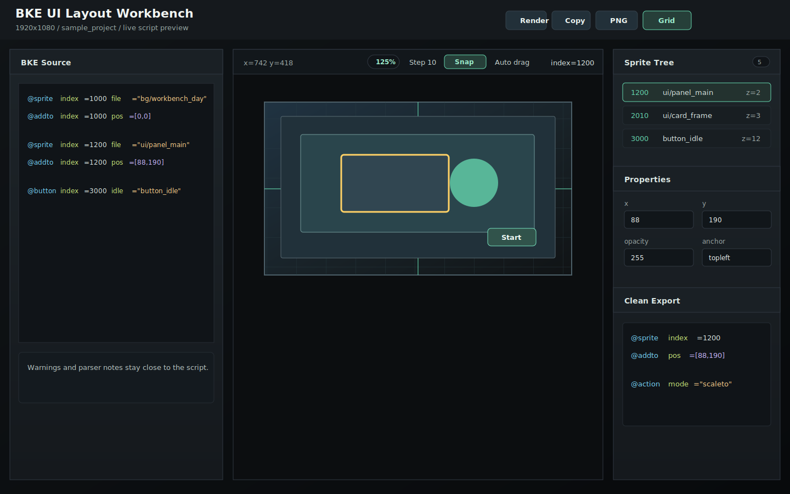

# BKE Layout Preview

BKE Layout Preview 是一个面向 BKEngine/BKE 脚本的 UI 布局预览器。它可以把常见的 `@sprite`、`@button`、`@buttonex`、`@layer`、`@textsprite`、`@addto`、`@anchor`、`@action` 等片段渲染到画布上，方便在不反复启动引擎的情况下调坐标、层级、透明度、缩放、旋转和锚点。

这个仓库是独立工具项目，不依赖任何具体游戏工程。内置的 `sample_project/` 是由脚本生成的占位示例，图片和脚本都不来自任何商业或私人项目。

## 界面预览



## 目录结构

- `src/`：前端界面与 BKE 片段解析、画布渲染逻辑
- `server/`：开发服务器和 Electron 共用的本地项目/素材读取服务
- `electron/`：桌面应用壳
- `sample_project/`：可随开源仓库发布的最小示例 BKE 项目
- `tools/sample/`：示例素材生成工具
- `tools/release/`：发布前清理、打包辅助工具
- `dist/`：构建产物，生成后不提交
- `release/`：Electron 打包产物，生成后不提交，正式版本建议上传到 GitHub Releases

## 快速开始

```powershell
npm install
npm run sample:assets
npm run dev
```

开发服务器默认使用 `http://127.0.0.1:5177/`。首次打开时，如果没有配置过 BKE 项目路径，工具会使用内置示例项目；也可以在界面中选择一个包含 `config.bkpsr` 的 BKE 项目根目录。

启动桌面应用：

```powershell
npm run app
```

构建网页产物：

```powershell
npm run build
```

打包 Windows 版本：

```powershell
npm run pack:win
npm run pack:win-portable
```

## 项目路径解析

工具会按以下顺序选择 BKE 项目根目录：

1. 本地设置中保存的 `projectRoot`
2. 环境变量 `BKE_PROJECT_ROOT`
3. 从当前工作目录向上查找 `config.bkpsr`
4. 从工具目录向上查找 `config.bkpsr`
5. 内置 `sample_project/`

读取到项目后，工具会解析 `config.bkpsr` 中的 `ResolutionSize` 和 `ImageAutoSearchPath`。图片路径可以按 BKE 风格书写，例如 `file="ui/panel_main"`；工具会依次尝试搜索路径和常见图片扩展名。

## 内置示例

`sample_project/` 只用于演示布局预览能力。PNG 素材由 Pillow 脚本生成，脚本位置：

```powershell
npm run sample:assets
```

示例片段位于 `sample_project/layout_demo.bkscr`。

## 当前支持

- `@sprite`，含 `rect=[x,y,w,h]`
- `@button`
- `@buttonex` 的 idle 精灵预览
- `@layer`
- `@textsprite`
- `@anchor`
- `@addto`
- `@action mode="moveto|moveby|fadeto|scaleto|scaleby|rotateto|rotatezto|rotateby|rotatezby"`
- `@zorder`
- `@effect mode="multiply"`
- `@remove`
- `##` 块中的简单 `var` 数组、字符串变量和数字表达式

## 获取与构建

这个仓库只包含源码、内置示例项目、工具脚本和 lockfile，不包含 `node_modules/`、`dist/`、`release/` 或本地配置文件。需要直接使用成品时，可以在 GitHub Releases 页面下载打包后的便携 EXE 或压缩包；需要从源码运行时，按“快速开始”中的命令启动即可。

如果要自行构建 Windows 便携版，可以运行：

```powershell
npm ci
npm run sample:assets
npm run build
npm run pack:win-portable
```

项目使用 `rollup` 的 WASM 包作为开发依赖，用来避开部分 Windows、Node 24、非 ASCII 路径组合下 native Rollup 包加载失败的问题。
